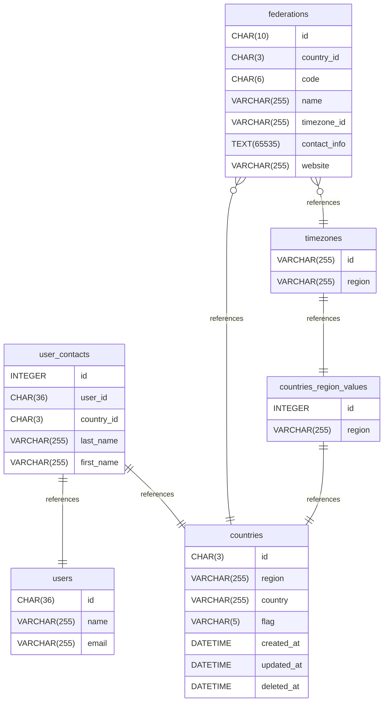

# pcpdb documentation

## Summary

- [Introduction](#introduction)
- [Database Type](#database-type)
- [Table Structure](#table-structure)
 	- [countries_region_values](#countries_region_values)
 	- [countries](#countries)
 	- [users](#users)
 	- [user_contacts](#user_contacts)
 	- [federations](#federations)
 	- [timezones](#timezones)
- [Relationships](#relationships)
- [Database Diagram](#database-diagram)

## Introduction

That doc was generated by web app based on <https://www.drawdb.app/>,
and its only a sample.  
PRO: easy to build  
CON: at now none

## Database type

- **Database system:** MySQL

## Table structure

### countries_region_values

aux table for countries.region value set

| Name        | Type          | Settings                      | References                    | Note                           |
|-------------|---------------|-------------------------------|-------------------------------|--------------------------------|
| **id** | INTEGER | 🔑 PK, not null, unique, autoincrement |  | |
| **region** | VARCHAR(255) | null | fk_countries_region_values_region_countries | |

#### Indexes

| Name | Unique | Fields |
|------|--------|--------|
| countries_region_values_index_0 | ✅ | region |

### countries

aux table english country name n country flag

| Name        | Type          | Settings                      | References                    | Note                           |
|-------------|---------------|-------------------------------|-------------------------------|--------------------------------|
| **id** | CHAR(3) | 🔑 PK, not null, unique |  |uppercase |
| **region** | VARCHAR(255) | null |  | |
| **country** | VARCHAR(255) | null |  |english country denomination |
| **flag** | VARCHAR(5) | null, default:   |  |unicode country flag |
| **created_at** | DATETIME | not null, default: CURRENT_TIMESTAMP |  | |
| **updated_at** | DATETIME | not null, default: CURRENT_TIMESTAMP |  | |
| **deleted_at** | DATETIME | null |  | |

#### Indexes

| Name | Unique | Fields |
|------|--------|--------|
| countries_index_2 | ✅ | country |
| countries_index_1 |  | region, country |

### users

standard laravel user table

| Name        | Type          | Settings                      | References                    | Note                           |
|-------------|---------------|-------------------------------|-------------------------------|--------------------------------|
| **id** | CHAR(36) | 🔑 PK, not null, unique |  |uuid |
| **name** | VARCHAR(255) | null |  | |
| **email** | VARCHAR(255) | null |  | |

### user_contacts

| Name        | Type          | Settings                      | References                    | Note                           |
|-------------|---------------|-------------------------------|-------------------------------|--------------------------------|
| **id** | INTEGER | 🔑 PK, not null, unique, autoincrement |  | |
| **user_id** | CHAR(36) | null | fk_user_contacts_user_id_users |fk users.id |
| **country_id** | CHAR(3) | null | fk_user_contacts_country_id_countries |fk counrtries.id |
| **last_name** | VARCHAR(255) | null |  | |
| **first_name** | VARCHAR(255) | null |  | |

#### Indexes

| Name | Unique | Fields |
|------|--------|--------|
| user_contacts_index_2 |  | country_id, last_name, first_name, user_id |

### federations

who define how good photo contest must be made

| Name        | Type          | Settings                      | References                    | Note                           |
|-------------|---------------|-------------------------------|-------------------------------|--------------------------------|
| **id** | CHAR(10) | 🔑 PK, not null, unique |  |internal use code based on country+code |
| **country_id** | CHAR(3) | null | fk_federations_country_id_countries |fk countries.id |
| **code** | CHAR(6) | null |  | |
| **name** | VARCHAR(255) | null |  | |
| **timezone_id** | VARCHAR(255) | null | fk_federations_timezone_id_timezones | |
| **contact_info** | TEXT(65535) | null |  |name and hq address |
| **website** | VARCHAR(255) | null |  |official website of the  |

#### Indexes

| Name | Unique | Fields |
|------|--------|--------|
| federations_index_2 | ✅ | country_id, code |
| federations_index_1 |  | name |

### timezones

aux table filled with valid php timezone

| Name        | Type          | Settings                      | References                    | Note                           |
|-------------|---------------|-------------------------------|-------------------------------|--------------------------------|
| **id** | VARCHAR(255) | 🔑 PK, not null, unique |  | |
| **region** | VARCHAR(255) | null | fk_timezones_region_countries_region_values | |

## Relationships

- **user_contacts to users**: one_to_one
- **user_contacts to countries**: one_to_one
- **countries_region_values to countries**: one_to_one
- **federations to countries**: many_to_one
- **timezones to countries_region_values**: one_to_one
- **federations to timezones**: many_to_one

## Database Diagram

