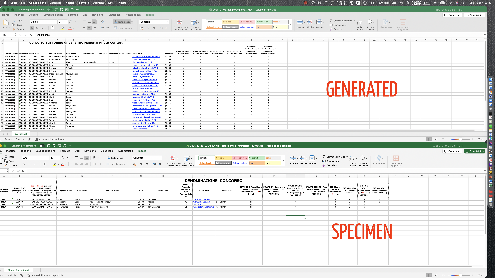

# Diario dello sviluppatore, data 10 gennaio 2026

* [index](../index.md) |
  [project](https://github.com/users/mrai64/projects/1/views/1?filterQuery=is%3Aopen&sortedBy%5Bdirection%5D=asc&sortedBy%5BcolumnId%5D=Title) issue list |
  [To Do List](../TDL.md) svuotato  

* [Route](/routes/web.php)

* [◀️ Diario di ieri](./2026-01-09_IT.md)

* run <http://yapcp.test/>
* User Doc <http://yapcp.test/docs/1.0/> [index](/resources/docs/1.0/index.md)
* [log](/storage/logs/laravel-2026-01-10.log)  | ngnix log  `open ~/Library/Application\ Support/Herd/Log`  `open ./storage/logs/`

## Today Do list

* Refactor scarico excel
* Refactor user > user_contact

## Scarico Excel

* ridenominare i file prevedendo un codice federazione e un codice versione, ok
ma dove posso registrare quale concorso deve fare il report vecchio e
qualche il nuovo? la discriminante dovrebbe essere l'anno d patrocinio,

### Report 1 partecipanti e ammessi [file di campionario](../2025-12/2025-12-26_ESEMPIO_file_Partecipanti_e_Ammissioni_2019Y1.xls)



* Rivedere la colonna codice patrocinio, va cambiata la
riga intestazione. Quando si va a pescare dal concorso la
lista dei codici patrocinio delle federazioni si devono
separare e va levato il guscio "FIAF[" "]" lasciando solo
il codice
* verificare che quando viene memorizzata una tessera
per quanto integer sia esposta come sei cifre "zero leading"
* verificare che se è presente il codice fiscale venga
esposto
* trovare come fare centrato testo e centrato verticale
nella riga di intestazione in maniera automatica,
vero che si può fare facilmente a mano ma comunque,
se si può in auto è meglio...
* trovare come impostarela dimensione in px dei campi
che alcuni devono essere più lunghi di altri

File coinvolti nel report FIAF partecipanti e ammessi versione 2026

* route web.app 'contest/export/{cid}/{fid}'  
deve diventare qualcosa come 'contest/report/{cid}',  
all'interno deve esserci la lettura del contest e dal campo
contests.federation_list *(che deve cambiare nome in*
*contests.federation_sponsor_codes)* vanno intercettati
i federation_id[federation_code] separati da spazi.

* controller /contest/report/Fiaf1Participants  
può mantenere il federation_id in testa seguito da un termine che indichi
il contenuto. Nel caso di FIAF ci sono 2 report da realizzare,
uno dedicato ai partecipanti&ammissioni cumulativo,
uno dedicato alle opere presentate. **ATTENZIONE**
Non si tratta del component che viene generato in livewire ma di un CONTROLLER
creato a parte e che ha vita diversa.
* exporter  /exports/contestparticipantexport  
Anche a questo va cambiato nome, deve riferirsi a colpo d'occhio
al report di cui è il generatore dati.
* view /resources/livewire/contest/report/fiaf1-participants  
viene richiamata all'interno del generatore
**ATTENZIONE** creando questa view si genera anche il suo
component in /app/livewire/contest/report ma va ignorato e cancellato.  

```sh
$ php artisan livewire:move Exports/ContestParticipantExport Exports/Fiaf1ParticipantsExport

   ErrorException 
```

Niente, il problema è stato che va a cercare il file nella cartella livewire/exports invece che nella cartella exports.
rinominato il file manualmente e rinominati i riferimenti.
