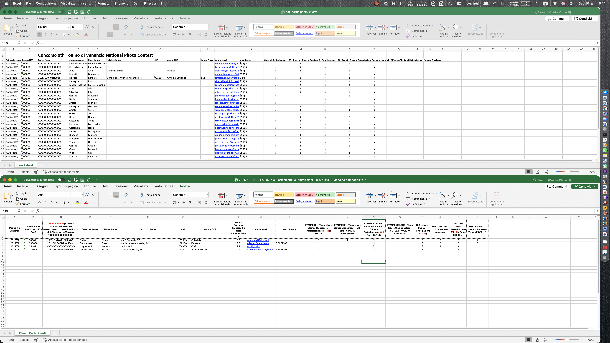

# Diario dello sviluppatore, data 10 gennaio 2026

* [index](../index.md) |
  [project](https://github.com/users/mrai64/projects/1/views/1?filterQuery=is%3Aopen&sortedBy%5Bdirection%5D=asc&sortedBy%5BcolumnId%5D=Title) issue list |
  [To Do List](../TDL.md) svuotato  

* [Route](/routes/web.php)

* [◀️ Diario di ieri](./2026-01-09_IT.md)

* run <http://yapcp.test/>
* User Doc <http://yapcp.test/docs/1.0/> [index](/resources/docs/1.0/index.md)
* [log](/storage/logs/laravel-2026-01-10.log) | ngnix log  `open ~/Library/Application\ Support/Herd/Log`  `open ./storage/logs/`

## Today Do list

* Refactor scarico excel
* Refactor user > user_contact

## Scarico Excel

* ridenominare i file prevedendo un codice federazione e un codice versione, ok
ma dove posso registrare quale concorso deve fare il report vecchio e
qualche il nuovo? la discriminante dovrebbe essere l'anno d patrocinio,

### Report 1 partecipanti e ammessi [file di campionario](../2025-12/2025-12-26_ESEMPIO_file_Partecipanti_e_Ammissioni_2019Y1.xls)


* Rivedere la colonna codice patrocinio, va cambiata la
riga intestazione. Quando si va a pescare dal concorso la
lista dei codici patrocinio delle federazioni si devono
separare e va levato il guscio "FIAF[" "]" lasciando solo
il codice
* verificare che quando viene memorizzata una tessera
per quanto integer sia esposta come sei cifre "zero leading"
* verificare che se è presente il codice fiscale venga
esposto
* trovare come fare centrato testo e centrato verticale
nella riga di intestazione in maniera automatica,
vero che si può fare facilmente a mano ma comunque,
se si può in auto è meglio...
* trovare come impostarela dimensione in px dei campi
che alcuni devono essere più lunghi di altri

File coinvolti nel report FIAF partecipanti e ammessi versione 2026

* route web.app 'contest/export/{cid}/{fid}'  
deve diventare qualcosa come 'contest/report/{cid}',  
all'interno deve esserci la lettura del contest e dal campo
contests.federation_list *(che deve cambiare nome in*
*contests.federation_sponsor_codes)* vanno intercettati
i federation_id[federation_code] separati da spazi.

* controller /contest/report/Fiaf1Participants  
può mantenere il federation_id in testa seguito da un termine che indichi
il contenuto. Nel caso di FIAF ci sono 2 report da realizzare,
uno dedicato ai partecipanti&ammissioni cumulativo,
uno dedicato alle opere presentate. **ATTENZIONE**
Non si tratta del component che viene generato in livewire ma di un CONTROLLER
creato a parte e che ha vita diversa.
* exporter  /exports/contestparticipantexport  
Anche a questo va cambiato nome, deve riferirsi a colpo d'occhio
al report di cui è il generatore dati.
* view /resources/livewire/contest/report/fiaf1-participants  
viene richiamata all'interno del generatore
**ATTENZIONE** creando questa view si genera anche il suo
component in /app/livewire/contest/report ma va ignorato e cancellato.  

```sh
$ php artisan livewire:move Exports/ContestParticipantExport Exports/Fiaf1ParticipantsExport

   ErrorException 
```

Niente, il problema è stato che va a cercare il file nella cartella livewire/exports invece che nella cartella exports.
rinominato il file manualmente e rinominati i riferimenti.

Nella intestazione del foglio c'è:

* il titolo completo sovraesteso della sezione tema  
"Stampe BN - Tema Libero Stampe Bianconero", seguito da
* " - partecipazione - ", seguito da
* " BN - LB"

Se LB è già **per regolamento FIAF** il codice sezione per libero bianconero,
perché **inventarsi** che va scritto BN - LB?
E se va preso ad ESEMPIO, perché è sbagliato secondo il regolamento?

Chiarimento: nel regolamento esistonole SEZIONI e i TEMI, BN è il codice della Sezione, LB è il codice del tema Libero,
pertanto la tabellina pitagorica prevede

| Sezione | Da regolamento |
| --- | --- |
| **BN** | Solo stampe bianconero no monocromatico, fno a 4 immagini partecipanti |
| **CLP** | Solo stampe a colori, fino a 4 immagini partecipanti |
| **DIG** | Solo digitale a colori jpg, fino a 4 immagini partecipanti |
| **PORTFOLIO** | Questo non ha sigle ma copre BN, CLP e DIG, tra 8 e 12 immagini partecipanti |
| **IS** | Solo immagini generate da programmi, parzialmente o totalmente (è fotografia? non interessa) |

Quind 5 Sezioni che possono avere ciascua il tuo TEMA,  
se il tema si ripete per diverse sezioni viene aggiunto un numero o una lettera, a distinguere.

| Tema | BN | CLP | DIG | PFL | IS | Da regolamento |
| --- | --- | --- | --- | --- | --- | --- |
| **LB** | ❓ | ✅ | ✅ | ✅ | ✅ | Tema Libero, può essere LB, LB2, LB3 ecc |
| **VR** | ✅ | ✅ | ✅ | ✅ | ✅ | Tema obbligato, di ampio interesse (...) VRA VRB VRC |
| **CL** | ❌ | ✅ | ✅ | ✅ | ✅ | Tema libero ma colore |
| **BN** | ✅ | ❌ | ✅ | ✅ | ✅ | Tema libero ma solo bianconero |
| | | | | | | Quindi la *sezione bianconero* del tema *libero bianconero* è BN BN, e non BN LB |
| **NA** | ✅ | ✅ | ✅ | ✅ | ❌ | Tema natura, con obblighi specificati in artt. successivi |
| **NW** | ✅ | ✅ | ✅ | ✅ | ❌ | Tema natura Wildlife, sottoinsieme di Natura |
| | | | | | | Si può fare natura anche coi fiori del giardino, natura wildlife dovrebbe essere i fiori de boschi |
| **CR** | ✅ | ✅ | ✅ | ✅ | ✅ | Tema creatività, che pure questo ha delle regole dedicate |
| **AE** | ✅ | ✅ | ✅ | ✅ | ❌ | Tema fotografia Aerea, droni ammessi |
| | . | . | . | . | . | Non si capisce perché specificare che vanno bene anche i droni, è come ammettere le Fujifilm Instax™ nei concorsi per stampe |
| **SM** | ✅ | ✅ | ✅ | ✅ | ❓ | Tema fotografia con Smartphone |
| **PN** | ✅ | ✅ | ✅ | ✅ | ❓ | Tema Panoramica |
| **PA** | ✅ | ✅ | ✅ | ✅ | ❓ | Tema Paesaggio |
| **ST** | ✅ | ✅ | ✅ | ✅ | ❓ | Tema Street |
| **RF** | ✅ | ✅ | ✅ | ✅ | ❓ | Tema Ritratto e Figura Ambientata |
| **AR** | ✅ | ✅ | ✅ | ✅ | ❓ | Tema Architettura |
| **SL** | ✅ | ✅ | ✅ | ✅ | ❓ | Tema Still life (natura morta) |
| **NU** | ✅ | ✅ | ✅ | ✅ | ❓ | Tema Nudo e Glamour |
| **SP** | ✅ | ✅ | ✅ | ✅ | ❓ | Tema Sport |
| **RP** | ✅ | ✅ | ✅ | ✅ | ❓ | Tema Reportage - Fotogiornalismo |
| **TR** | ✅ | ✅ | ✅ | ✅ | ❓ | Tema Travel - foto di Viaggio |

La combo Sezione - Tema non è una tavola pitagorica piena in ogni incrocio,
pertanto i MOLTI codici no sono tutti. Non è possibile fare
un concorso per stampe a colori. Specialmente la categoria delle
immagini generate parzialmente o completamente da programmi, che a farla
semplice *non passano da un buco*, non sono scritte con la luce, possono
avere dei soggetti di sport e still life ma sono di fatto concorsi di *grafica* senza *foto*.

Si può ragionevolmente ritenere che delle combo elencate ne sarà
utilizzato 1/10. Vengono anche aggiunti dei limiti per il
numero di combo utilizzabili, per concorso al massimo 9 combo.
per le sezioni BN, CLP, PORTFOLIO ci possono essere massimo 3 temi
con patrocinio, implicitamente una quarta sezione-tema
si può fare ma non conta per la statistica.
Fino a 4 temi per la sezione DIG.
3 temi BN 3 temi CLP 3 temi DIG fanno già 9.
Non più di 1 combo per IS.

Quindi per FIAF serve ri-codificare l'elenco delle sezioni con le combo
sezione-tema (per forza di cose, essendo la piattaforma digitale, tutte DIG-xx)


