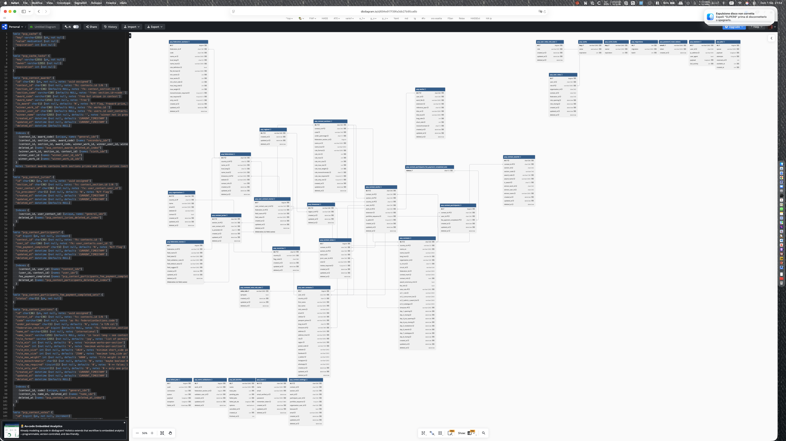

# 01/02/2026

[index](../index.md) | [ieri](../2026-01/2026-01-31_IT.md)  
[Docs](/resources/docs/1.0/overview.md)

## Storico

Sto rallentando lo sviluppo perché boh, ma non c'è solo lo sviluppo
della piattaforma. Riprendo in mano il regolamento dei concorsi FIAF
a seguito anche del rinnovo del sito federale di gestione
delle statistiche e dei concorsi.

### Appunti

### Il nome delle foto è modificabile fino alla prima ammissione  

Posto che il nome del file può essere basato sul codice uuid
assegnato al file al momento del caricamento, il titolo del
lavoro / opera viene abbinato al lavoro, ma il fatto
che possa cambiare nel tempo, fino a quando viene data la
prima ammissione comporta:

* che il nome del file non deve essere legato al titolo
dell'opera
* quindi deve essere posto in una tabella legata
alla tabella dei lavori, con una relazione 1:N
* che al titolo dell'opera deve essere assegnato un
flag che dichiara se quel titolo è di un'opera ammessa
e quindi controlla che sia immutabile.  
**Serve una tabella nuova?** Di fatto no, si può aggiungere il
campo alla tabella contest_works, nullable. Oppure
si procede con una tabella contest_works_mores
l cui principio è lo stesso di user_contact_mores,
ovvero gestire "campi di federazione" per le tabelle
che contengono campi "condivisi da tutti".

**VALE PER I CONCORSI A PATROCINIO FIAF**  
e per gli altri? la questione riguarda i regolamenti
e cerco quali sono i punti in comune e quali in cui
differiscono. Ho aperto un repository in github
e in questo partendo dalla FIAF sto traducendo
in inglese il regolamento perché sia comprensibile.

Posso procedere un articolo alla volta, comma per comma
oppure cercare di estrapolare dal regolamento la serie
di condizioni che sono l'ossatura dello stesso.

**Concorsi per stampe**, non sono concorsi per immagini digitali e
per motivi pratici non si possono fare giurie in remoto
e valutare le opere a distanza.

## Aggiornato mysql-schema

In terminale (di macosx) comando 

```sh
mysqldump --socket /tmp/mysql_3306.sock -u root --port=3306 -p --no-data pcpdb > ~/Downloads/yapcp.sql
```

Passato il file copia incolla in <https://dbdiagram.io/d/694e917f39fa3db27b95ca6b>

Disegno db a oggi


## Da aggiungere alle cose da fare

* Gestione "storico" concorsi
