# Untitled Diagram documentation

## Summary

- [Introduction](#introduction)
- [Database Type](#database-type)
- [Table Structure](#table-structure)
  - [cache](#cache)
  - [cache_locks](#cache_locks)
  - [contest_awards](#contest_awards)
  - [contest_juries](#contest_juries)
  - [contest_participants](#contest_participants)
  - [contest_sections](#contest_sections)
  - [contest_votes](#contest_votes)
  - [contest_waitings](#contest_waitings)
  - [contest_works](#contest_works)
  - [contests](#contests)
  - [contests_vote_rule_sets](#contests_vote_rule_sets)
  - [countries](#countries)
  - [failed_jobs](#failed_jobs)
  - [federation_mores](#federation_mores)
  - [federation_sections](#federation_sections)
  - [federations](#federations)
  - [job_batches](#job_batches)
  - [jobs](#jobs)
  - [migrations](#migrations)
  - [organizations](#organizations)
  - [password_reset_tokens](#password_reset_tokens)
  - [regions](#regions)
  - [sessions](#sessions)
  - [timezones](#timezones)
  - [user_contact_mores](#user_contact_mores)
  - [user_contacts](#user_contacts)
  - [user_roles](#user_roles)
  - [user_roles_context_sets](#user_roles_context_sets)
  - [user_roles_role_sets](#user_roles_role_sets)
  - [user_work_validations](#user_work_validations)
  - [user_works](#user_works)
  - [users](#users)
- [Relationships](#relationships)
- [Database Diagram](#database-diagram)

## Introduction

That's a laravel learning project to build a photographic contest management platform.
Our goal is *build and improve*.

## Database type

- **Database system:** MySQL

## Table structure

### cache

| Name        | Type          | Settings                      | References                    | Note                           |
|-------------|---------------|-------------------------------|-------------------------------|--------------------------------|
| **key** | VARCHAR(255) | 🔑 PK, not null |  | |
| **value** | MEDIUMTEXT | not null |  | |
| **expiration** | INTEGER | not null |  | |

### cache_locks

| Name        | Type          | Settings                      | References                    | Note                           |
|-------------|---------------|-------------------------------|-------------------------------|--------------------------------|
| **key** | VARCHAR(255) | 🔑 PK, not null |  | |
| **owner** | VARCHAR(255) | not null |  | |
| **expiration** | INTEGER | not null |  | |

### contest_awards

Contest:award list for every section and for contest/circuit

| Name        | Type          | Settings                      | References                    | Note                           |
|-------------|---------------|-------------------------------|-------------------------------|--------------------------------|
| **id** | CHAR(36) | 🔑 PK, not null |  |real pk si contest_id + award_code |
| **contest_id** | CHAR(36) | not null |  |fk: contests.id contest_sections.contest_id |
| **section_id** | CHAR(36) | null, default: NULL |  |fk: contest_sections.id |
| **section_code** | VARCHAR(10) | null, default: NULL |  |from: section.id->code | null for contest/circuit |
| **award_code** | VARCHAR(10) | not null |  |mut be unique in contest |
| **award_name** | VARCHAR(255) | not null |  |free |
| **is_award** | TINYINT | not null, default: 0 |  |true - award/award prize, false - HM or other |
| **winner_work_id** | CHAR(36) | null, default: NULL |  | |
| **winner_user_id** | CHAR(36) | null, default: NULL |  | |
| **winner_name** | VARCHAR(255) | not null |  |winner not in previous cols |
| **created_at** | DATETIME | not null, default: CURRENT_TIMESTAMP |  | |
| **updated_at** | DATETIME | not null, default: CURRENT_TIMESTAMP |  | |
| **deleted_at** | DATETIME | null, default: NULL |  | |

### contest_juries

juror contest section list

| Name        | Type          | Settings                      | References                    | Note                           |
|-------------|---------------|-------------------------------|-------------------------------|--------------------------------|
| **id** | CHAR(36) | 🔑 PK, not null |  |reak pk section_id + juror user_id |
| **contest_id** | CHAR(36) | not null |  |fk: contests.id |
| **section_id** | CHAR(36) | not null |  |fk: contest_sections.id |
| **user_id** | CHAR(36) | not null |  |fk: user_contacts.id - juror |
| **is_president** | TINYINT | not null, default: 0 |  |used to put first in juror list |
| **created_at** | DATETIME | not null, default: CURRENT_TIMESTAMP |  | |
| **updated_at** | DATETIME | not null, default: CURRENT_TIMESTAMP |  | |
| **deleted_at** | DATETIME | null, default: NULL |  | |

### contest_participants

Participant list w/fee semaphore

| Name        | Type          | Settings                      | References                    | Note                           |
|-------------|---------------|-------------------------------|-------------------------------|--------------------------------|
| **id** | BIGINT | 🔑 PK, not null, autoincrement |  | |
| **contest_id** | CHAR(36) | not null |  | |
| **user_id** | CHAR(36) | not null |  | |
| **fee_payment_completed** | TINYINT | not null, default: 0 |  |reserved for contest organization members |
| **created_at** | DATETIME | not null, default: CURRENT_TIMESTAMP |  | |
| **updated_at** | DATETIME | not null, default: CURRENT_TIMESTAMP |  | |
| **deleted_at** | DATETIME | null, default: NULL |  | |

### contest_sections

| Name        | Type          | Settings                      | References                    | Note                           |
|-------------|---------------|-------------------------------|-------------------------------|--------------------------------|
| **id** | CHAR(36) | 🔑 PK, not null |  |real pk contest_id n code |
| **contest_id** | CHAR(36) | not null |  |fk: contests.id |
| **code** | VARCHAR(10) | not null |  |fk: federationSections.code but also not |
| **under_patronage** | TINYINT | not null, default: 0 |  |section-theme valid for federation |
| **federation_section_id** | BIGINT | null, default: NULL |  |fk: federation_sections.id |
| **name_en** | VARCHAR(255) | not null |  |international |
| **name_local** | VARCHAR(255) | null, default: NULL |  |in local lang - see contests.lang_local |
| **rule_format** | VARCHAR(255) | not null, default: jpg |  |list of permitted extension |
| **rule_min** | INTEGER | not null, default: 0 |  |minimum works-per-section |
| **rule_max** | INTEGER | not null, default: 4 |  |maximum works-per-section |
| **rule_min_size** | INTEGER | not null, default: 1024 |  |minimum short_side px |
| **rule_max_size** | INTEGER | not null, default: 2500 |  |maximum long_side px |
| **rule_max_weight** | INTEGER | not null, default: 6000 |  |file weight in KB |
| **rule_monochromatic** | TINYINT | not null, default: 0 |  |BW / M only |
| **rule_raw_required** | TINYINT | not null, default: 0 |  |RAW required |
| **rule_only_one** | TINYINT | not null, default: 0 |  |unique award per person per section-theme |
| **created_at** | DATETIME | not null, default: CURRENT_TIMESTAMP |  | |
| **updated_at** | DATETIME | not null, default: CURRENT_TIMESTAMP |  | |
| **deleted_at** | DATETIME | null, default: NULL |  | |

### contest_votes

The juror vote board

| Name        | Type          | Settings                      | References                    | Note                           |
|-------------|---------------|-------------------------------|-------------------------------|--------------------------------|
| **id** | BIGINT | 🔑 PK, not null, autoincrement |  |real pk: section_id + work_id + juror_id |
| **contest_id** | CHAR(36) | not null |  |fk: contests.id contest_sections.contest_id |
| **section_id** | CHAR(36) | not null | fk_contest_votes_section_id_contest_sections |fk: contest_sections.id |
| **work_id** | CHAR(36) | not null |  |fk: contest_works.work_id user_works.id |
| **juror_user_id** | CHAR(36) | not null |  |fk: user_contacts.id juror |
| **vote** | VARCHAR(255) | not null |  |based on contests.vote_rule |
| **review_required** | TINYINT | not null, default: 0 |  |false - not required |
| **created_at** | DATETIME | not null, default: CURRENT_TIMESTAMP |  | |
| **updated_at** | DATETIME | not null, default: CURRENT_TIMESTAMP |  |date of vote |
| **deleted_at** | DATETIME | null, default: NULL |  | |

### contest_waitings

Parking table for user_works with any problem

| Name        | Type          | Settings                      | References                    | Note                           |
|-------------|---------------|-------------------------------|-------------------------------|--------------------------------|
| **id** | CHAR(36) | 🔑 PK, not null |  |real pk: contest_work_id |
| **contest_id** | CHAR(36) | not null |  |fk: contests.id |
| **section_id** | CHAR(36) | not null | fk_contest_waitings_section_id_contest_sections |fk: contest_sections.id |
| **user_work_id** | CHAR(36) | not null |  |fk: user_works.id |
| **portfolio_sequence** | TINYINT | not null, default: 0 |  |to ripristinate original record |
| **participant_user_id** | CHAR(36) | not null |  |fk: user_contacts.id author |
| **email** | VARCHAR(255) | not null |  |for notification |
| **organization_user_id** | CHAR(36) | not null |  |fk: user_works.id organization member |
| **because** | TEXT | not null |  |why that work is out |
| **created_at** | DATETIME | not null, default: CURRENT_TIMESTAMP |  | |
| **updated_at** | DATETIME | not null, default: CURRENT_TIMESTAMP |  | |
| **deleted_at** | DATETIME | null, default: NULL |  | |

### contest_works

| Name        | Type          | Settings                      | References                    | Note                           |
|-------------|---------------|-------------------------------|-------------------------------|--------------------------------|
| **id** | CHAR(36) | 🔑 PK, not null |  | |
| **contest_id** | CHAR(36) | not null |  |fk: contests.id |
| **section_id** | CHAR(36) | not null | fk_contest_works_section_id_contest_sections |fk: contest_sections.id |
| **country_id** | CHAR(3) | not null |  |fk: countries.id  |
| **user_id** | CHAR(36) | not null |  |fk:user_contacts.id author |
| **work_id** | CHAR(36) | not null |  |fk: user_works.id |
| **extension** | VARCHAR(6) | not null, default: jpg |  |used to build file name |
| **portfolio_sequence** | TINYINT | not null, default: 0 |  |sequence also for portfolio |
| **is_admit** | TINYINT | not null, default: 0 |  |0 = not admit, admit otherwise |
| **created_at** | DATETIME | not null, default: CURRENT_TIMESTAMP |  | |
| **updated_at** | DATETIME | not null, default: CURRENT_TIMESTAMP |  | |
| **deleted_at** | DATETIME | null, default: NULL |  | |

### contests

| Name        | Type          | Settings                      | References                    | Note                           |
|-------------|---------------|-------------------------------|-------------------------------|--------------------------------|
| **id** | CHAR(36) | 🔑 PK, not null |  | |
| **country_id** | CHAR(3) | not null |  |fk: countries.id |
| **name_en** | VARCHAR(255) | not null |  | |
| **name_local** | VARCHAR(255) | null, default: NULL |  | |
| **lang_local** | VARCHAR(5) | not null, default: en |  |dev: in LangList[] |
| **organization_id** | CHAR(36) | not null |  |fk: organizations.id |
| **is_circuit** | CHAR(1) | not null, default: N |  |Y/N, N when not Y |
| **circuit_id** | VARCHAR(36) | null, default: NULL |  |null or a valid contest.id |
| **federation_list** | VARCHAR(255) | null, default: NULL |  |under patronage of federation code[] |
| **contest_mark** | VARCHAR(255) | null, default: NULL |  |The contest or organization passport photo - mark |
| **contact_info** | TEXT | not null |  |contest headquarter, email and so on |
| **award_ceremony_info** | TEXT | null |  |Site and date, or link to broadcast platform |
| **fee_info** | TEXT | null |  |only text description of fee for participation |
| **vote_rule** | VARCHAR(255) | not null, default: num:1..10 |  |fk: contests_vote_rule_sets.vote_rule |
| **url_1_rule** | VARCHAR(255) | null, default: NULL |  |how read english rules and subscribe link |
| **url_2_concurrent_list** | VARCHAR(255) | null, default: NULL |  | |
| **url_3_admit_n_award_list** | VARCHAR(255) | null, default: NULL |  |only the result list, not a catalogue |
| **url_4_catalogue** | VARCHAR(255) | null, default: NULL |  |catalogue download page |
| **timezone_id** | VARCHAR(255) | not null |  |fk: timezones.id |
| **day_1_opening** | DATETIME | not null |  |T1 Reveal the contest, opening for subscription |
| **day_2_closing** | DATETIME | not null |  |T2 >= T1 End of receive works |
| **day_3_jury_opening** | DATETIME | not null |  |T3 > T2 Start of juror works |
| **day_4_jury_closing** | DATETIME | not null |  |T4 >= T3 End of juror works |
| **day_5_revelations** | DATETIME | not null |  |T5 > T4 Publicly result communications |
| **day_6_awards** | DATETIME | not null |  |T6 > T5 Award Ceremony |
| **day_7_catalogues** | DATETIME | not null |  |T7 > T6 Publicly Catalogue publications |
| **day_8_closing** | DATETIME | not null |  |T8 > T7 Closing date for award postal send |
| **created_at** | DATETIME | not null, default: CURRENT_TIMESTAMP |  | |
| **updated_at** | DATETIME | not null, default: CURRENT_TIMESTAMP |  | |
| **deleted_at** | DATETIME | null, default: NULL |  | |

### contests_vote_rule_sets

| Name        | Type          | Settings                      | References                    | Note                           |
|-------------|---------------|-------------------------------|-------------------------------|--------------------------------|
| **id** | BIGINT | 🔑 PK, not null, autoincrement |  | |
| **vote_rule** | VARCHAR(255) | not null |  | |
| **synopsis** | TEXT | null |  | |
| **created_at** | DATETIME | not null, default: CURRENT_TIMESTAMP |  | |
| **updated_at** | DATETIME | not null, default: CURRENT_TIMESTAMP |  | |
| **deleted_at** | DATETIME | null, default: NULL |  | |

### countries

based on iso-3166, but hand filled

| Name        | Type          | Settings                      | References                    | Note                           |
|-------------|---------------|-------------------------------|-------------------------------|--------------------------------|
| **id** | CHAR(3) | 🔑 PK, not null |  |iso-3166 alpha-3 uppercase |
| **country** | VARCHAR(255) | not null |  |english official |
| **flag_code** | CHAR(20) | null, default: NULL |  |Unicode chars for country flag emoji |
| **lang_code** | CHAR(2) | null, default: NULL |  |when used in lang=xx_YY |
| **created_at** | DATETIME | not null, default: CURRENT_TIMESTAMP |  | |
| **updated_at** | DATETIME | not null, default: CURRENT_TIMESTAMP |  | |
| **deleted_at** | DATETIME | null, default: NULL |  | |

### failed_jobs

| Name        | Type          | Settings                      | References                    | Note                           |
|-------------|---------------|-------------------------------|-------------------------------|--------------------------------|
| **id** | BIGINT | 🔑 PK, not null, autoincrement |  | |
| **uuid** | VARCHAR(255) | not null |  | |
| **connection** | TEXT | not null |  | |
| **queue** | TEXT | not null |  | |
| **payload** | LONGTEXT | not null |  | |
| **exception** | LONGTEXT | not null |  | |
| **failed_at** | TIMESTAMP | not null, default: CURRENT_TIMESTAMP |  | |

### federation_mores

| Name        | Type          | Settings                      | References                    | Note                           |
|-------------|---------------|-------------------------------|-------------------------------|--------------------------------|
| **id** | BIGINT | 🔑 PK, not null, autoincrement |  |the real pk is federation_id + field_name |
| **federation_id** | VARCHAR(10) | not null |  |fk federations.id |
| **field_name** | VARCHAR(20) | not null |  |lowercase |
| **field_label** | VARCHAR(255) | not null |  |label for the field |
| **field_validation_rules** | VARCHAR(255) | not null, default: string|max:255 |  |string or function(), validation rules for the field, nullable if none |
| **field_default_value** | VARCHAR(255) | not null |  |empty string as default default value |
| **field_suggest** | VARCHAR(255) | not null |  |message to explain what insert |
| **created_at** | DATETIME | not null, default: CURRENT_TIMESTAMP |  | |
| **updated_at** | DATETIME | not null, default: CURRENT_TIMESTAMP |  | |
| **deleted_at** | DATETIME | null, default: NULL |  | |

### federation_sections

| Name        | Type          | Settings                      | References                    | Note                           |
|-------------|---------------|-------------------------------|-------------------------------|--------------------------------|
| **id** | BIGINT | 🔑 PK, not null, autoincrement |  |real pk is federation_id + code |
| **federation_id** | CHAR(10) | not null |  | |
| **code** | CHAR(10) | not null |  | |
| **name_en** | VARCHAR(255) | not null |  |official name in english |
| **local_lang** | CHAR(2) | not null, default: en |  |follow iso-3166 2 ascii lowercase |
| **name_local** | VARCHAR(255) | not null |  |in local name |
| **rule_definition** | TEXT | null |  |synopsis from federal regulation docs |
| **file_formats** | VARCHAR(255) | not null, default: jpg,tif,raw,raf,nef,cr2 |  |list of ext, comma separated |
| **min_works** | INTEGER | not null, default: 0 |  |greater zero == portfolio |
| **max_works** | INTEGER | not null, default: 4 |  | |
| **min_short_side** | INTEGER | not null, default: 1080 |  |px |
| **max_long_side** | INTEGER | not null, default: 2500 |  |px |
| **max_weight** | INTEGER | not null, default: 6000000 |  |Bytes |
| **monochromatic_required** | TINYINT | not null, default: 0 |  |0 == false, 1 == true |
| **raw_required** | TINYINT | not null, default: 0 |  |section require raw original works (not only) |
| **only_one** | TINYINT | not null, default: 0 |  |required only one prize / author n section |
| **created_at** | DATETIME | not null, default: CURRENT_TIMESTAMP |  | |
| **updated_at** | DATETIME | not null, default: CURRENT_TIMESTAMP |  | |
| **deleted_at** | DATETIME | null, default: NULL |  | |

### federations

Who build the contest rules for patronages

| Name        | Type          | Settings                      | References                    | Note                           |
|-------------|---------------|-------------------------------|-------------------------------|--------------------------------|
| **id** | CHAR(10) | 🔑 PK, not null |  |UPPER, when code are equals add :country_id to both |
| **country_id** | CHAR(3) | not null | fk_federations_country_id_countries |fk countries.id |
| **name_en** | VARCHAR(255) | not null |  |official name in english |
| **website** | VARCHAR(255) | not null |  |official website or fb info page |
| **local_lang** | CHAR(5) | not null, default: en |  |follow iso-3166 2 ascii lowercase |
| **name_local** | VARCHAR(255) | not null |  |when differ from official english |
| **timezone_id** | VARCHAR(255) | not null |  |HQ address |
| **contact_info** | TEXT | not null |  |HQ address, email, and other infos |
| **created_at** | DATETIME | not null, default: CURRENT_TIMESTAMP |  | |
| **updated_at** | DATETIME | not null, default: CURRENT_TIMESTAMP |  | |
| **deleted_at** | DATETIME | null, default: NULL |  | |

### job_batches

| Name        | Type          | Settings                      | References                    | Note                           |
|-------------|---------------|-------------------------------|-------------------------------|--------------------------------|
| **id** | VARCHAR(255) | 🔑 PK, not null |  | |
| **name** | VARCHAR(255) | not null |  | |
| **total_jobs** | INTEGER | not null |  | |
| **pending_jobs** | INTEGER | not null |  | |
| **failed_jobs** | INTEGER | not null |  | |
| **failed_job_ids** | LONGTEXT | not null |  | |
| **options** | MEDIUMTEXT | null |  | |
| **cancelled_at** | INTEGER | null, default: NULL |  | |
| **created_at** | INTEGER | not null |  | |
| **finished_at** | INTEGER | null, default: NULL |  | |

### jobs

| Name        | Type          | Settings                      | References                    | Note                           |
|-------------|---------------|-------------------------------|-------------------------------|--------------------------------|
| **id** | BIGINT | 🔑 PK, not null, autoincrement |  | |
| **queue** | VARCHAR(255) | not null |  | |
| **payload** | LONGTEXT | not null |  | |
| **attempts** | TINYINT | not null |  | |
| **reserved_at** | INTEGER | null, default: NULL |  | |
| **available_at** | INTEGER | not null |  | |
| **created_at** | INTEGER | not null |  | |

### migrations

| Name        | Type          | Settings                      | References                    | Note                           |
|-------------|---------------|-------------------------------|-------------------------------|--------------------------------|
| **id** | INTEGER | 🔑 PK, not null, autoincrement |  | |
| **migration** | VARCHAR(255) | not null |  | |
| **batch** | INTEGER | not null |  | |

### organizations

who organize contests

| Name        | Type          | Settings                      | References                    | Note                           |
|-------------|---------------|-------------------------------|-------------------------------|--------------------------------|
| **id** | CHAR(36) | 🔑 PK, not null |  | |
| **country_id** | CHAR(3) | not null | fk_organizations_country_id_countries |fk: countries.id - hq country |
| **name** | VARCHAR(255) | not null |  |english official |
| **email** | VARCHAR(255) | not null |  | |
| **website** | VARCHAR(255) | null, default: NULL |  |official organization website |
| **contact** | TEXT | null |  |hq postal address |
| **created_at** | DATETIME | not null, default: CURRENT_TIMESTAMP |  | |
| **updated_at** | DATETIME | not null, default: CURRENT_TIMESTAMP |  | |
| **deleted_at** | DATETIME | null, default: NULL |  | |

### password_reset_tokens

user reserved

| Name        | Type          | Settings                      | References                    | Note                           |
|-------------|---------------|-------------------------------|-------------------------------|--------------------------------|
| **email** | VARCHAR(255) | 🔑 PK, not null |  | |
| **token** | VARCHAR(255) | not null |  | |
| **created_at** | DATETIME | null, default: NULL |  | |

### regions

timezones lookup table

| Name        | Type          | Settings                      | References                    | Note                           |
|-------------|---------------|-------------------------------|-------------------------------|--------------------------------|
| **id** | CHAR(12) | 🔑 PK, not null |  | |
| **created_at** | DATETIME | not null, default: CURRENT_TIMESTAMP |  | |
| **updated_at** | DATETIME | not null, default: CURRENT_TIMESTAMP |  | |
| **deleted_at** | DATETIME | null, default: NULL |  | |

### sessions

| Name        | Type          | Settings                      | References                    | Note                           |
|-------------|---------------|-------------------------------|-------------------------------|--------------------------------|
| **id** | VARCHAR(255) | 🔑 PK, not null |  | |
| **user_id** | CHAR(36) | null, default: NULL |  | |
| **ip_address** | VARCHAR(45) | null, default: NULL |  | |
| **user_agent** | TEXT | null |  | |
| **payload** | LONGTEXT | not null |  | |
| **last_activity** | INTEGER | not null |  | |

### timezones

deadline time management must have

| Name        | Type          | Settings                      | References                    | Note                           |
|-------------|---------------|-------------------------------|-------------------------------|--------------------------------|
| **id** | VARCHAR(40) | 🔑 PK, not null |  |valid for php_timezones |
| **region_id** | CHAR(12) | not null | fk_timezones_region_id_regions |fk regions.id |
| **created_at** | DATETIME | not null, default: CURRENT_TIMESTAMP |  | |
| **updated_at** | DATETIME | not null, default: CURRENT_TIMESTAMP |  | |
| **deleted_at** | DATETIME | null, default: NULL |  | |

### user_contact_mores

additional values for user_contacts based on federation_mores

| Name        | Type          | Settings                      | References                    | Note                           |
|-------------|---------------|-------------------------------|-------------------------------|--------------------------------|
| **id** | BIGINT | 🔑 PK, not null, autoincrement |  |real pk is user_contact_id n federation_id n field_name |
| **user_id** | CHAR(36) | not null |  |fk for user_contact id |
| **federation_id** | VARCHAR(10) | not null | fk_user_contact_mores_federation_id_federation_mores |fk federation_mores |
| **field_name** | VARCHAR(20) | not null |  |fk federation_mores |
| **field_value** | VARCHAR(255) | not null |  |following rules when updated |
| **created_at** | DATETIME | not null, default: CURRENT_TIMESTAMP |  | |
| **updated_at** | DATETIME | not null, default: CURRENT_TIMESTAMP |  | |
| **deleted_at** | DATETIME | null, default: NULL |  | |

### user_contacts

the real users info table

| Name        | Type          | Settings                      | References                    | Note                           |
|-------------|---------------|-------------------------------|-------------------------------|--------------------------------|
| **id** | CHAR(36) | 🔑 PK, not null |  |aligned to users.id |
| **user_id** | CHAR(36) | not null |  |fk users.id |
| **country_id** | CHAR(3) | not null | fk_user_contacts_country_id_countries |fk: countries.id |
| **first_name** | VARCHAR(255) | not null |  | |
| **last_name** | VARCHAR(255) | not null |  | |
| **nick_name** | VARCHAR(255) | null, default: NULL |  |alias, aka |
| **email** | VARCHAR(255) | not null |  |aligned to users.email |
| **cellular** | VARCHAR(20) | not null |  |country code prefixed |
| **passport_photo** | VARCHAR(255) | not null, default: anon.jpg |  |as rounded avatars |
| **lang_local** | CHAR(5) | not null, default: en |  |xx_YY - for future use in html lang |
| **timezone_id** | VARCHAR(40) | not null, default: Europe/Rome | fk_user_contacts_timezone_id_timezones |fk: timezones.id |
| **address** | VARCHAR(255) | not null |  |in latin char |
| **address_line2** | VARCHAR(255) | not null |  | |
| **city** | VARCHAR(255) | not null |  | |
| **region** | VARCHAR(255) | not null |  |not timezone region |
| **postal_code** | VARCHAR(10) | not null |  | |
| **website** | VARCHAR(255) | null, default: NULL |  |url of personal site |
| **facebook** | VARCHAR(255) | null, default: NULL |  |url of personal page |
| **x_twitter** | VARCHAR(255) | null, default: NULL |  |url of personal page |
| **instagram** | VARCHAR(255) | null, default: NULL |  |url of personal page |
| **whatsapp** | VARCHAR(255) | null, default: NULL |  |url to chat into |
| **created_at** | DATETIME | not null, default: CURRENT_TIMESTAMP |  | |
| **updated_at** | DATETIME | not null, default: CURRENT_TIMESTAMP |  | |
| **deleted_at** | DATETIME | null, default: NULL |  | |

### user_roles

| Name        | Type          | Settings                      | References                    | Note                           |
|-------------|---------------|-------------------------------|-------------------------------|--------------------------------|
| **id** | BIGINT | 🔑 PK, not null, autoincrement |  | |
| **user_id** | CHAR(36) | not null |  |fk: user_contacts.id |
| **role** | VARCHAR(255) | not null, default: member |  |fk: user_roles_role_sets.role |
| **organization_id** | CHAR(36) | null, default: NULL | fk_user_roles_organization_id_organizations |fk: organizations.id |
| **contest_id** | CHAR(36) | null, default: NULL | fk_user_roles_contest_id_contests |fk: contests.id |
| **federation_id** | CHAR(10) | null, default: NULL | fk_user_roles_federation_id_federations |fk: federations.id |
| **role_opening** | DATETIME | not null, default: CURRENT_TIMESTAMP |  |Start of role works - default: today |
| **role_closing** | DATETIME | not null, default: 9999-12-31 23:59:59 |  |End of role works default:future |
| **created_at** | DATETIME | not null, default: CURRENT_TIMESTAMP |  | |
| **updated_at** | DATETIME | not null, default: CURRENT_TIMESTAMP |  | |
| **deleted_at** | DATETIME | null, default: NULL |  | |

### user_roles_context_sets

lookup table for: user_roles.context_type

| Name        | Type          | Settings                      | References                    | Note                           |
|-------------|---------------|-------------------------------|-------------------------------|--------------------------------|
| **id** | BIGINT | 🔑 PK, not null, autoincrement |  | |
| **context_type** | CHAR(10) | not null |  |the real pk |
| **created_at** | DATETIME | not null, default: CURRENT_TIMESTAMP |  | |
| **updated_at** | DATETIME | not null, default: CURRENT_TIMESTAMP |  | |
| **deleted_at** | DATETIME | null, default: NULL |  | |

### user_roles_role_sets

lookup table for: user_roles.role

| Name        | Type          | Settings                      | References                    | Note                           |
|-------------|---------------|-------------------------------|-------------------------------|--------------------------------|
| **id** | BIGINT | 🔑 PK, not null, autoincrement |  | |
| **role** | VARCHAR(25) | not null |  |the real pk |
| **created_at** | DATETIME | not null, default: CURRENT_TIMESTAMP |  | |
| **updated_at** | DATETIME | not null, default: CURRENT_TIMESTAMP |  | |
| **deleted_at** | DATETIME | null, default: NULL |  | |

### user_work_validations

human check for user_works on federation_sections

| Name        | Type          | Settings                      | References                    | Note                           |
|-------------|---------------|-------------------------------|-------------------------------|--------------------------------|
| **id** | BIGINT | 🔑 PK, not null, autoincrement |  |real pk is: work_id + federation_section_id |
| **work_id** | CHAR(36) | not null |  |fk: user_works.id |
| **federation_section_id** | BIGINT | not null | fk_user_work_validations_federation_section_id_federation_sections |fk: federation_sections.id  |
| **validator_user_id** | CHAR(36) | not null | fk_user_work_validations_validator_user_id_user_contacts |contest organization members that validate the work for specific section |
| **created_at** | DATETIME | not null, default: CURRENT_TIMESTAMP |  | |
| **updated_at** | DATETIME | not null, default: CURRENT_TIMESTAMP |  | |
| **deleted_at** | DATETIME | null, default: NULL |  | |

### user_works

| Name        | Type          | Settings                      | References                    | Note                           |
|-------------|---------------|-------------------------------|-------------------------------|--------------------------------|
| **id** | CHAR(36) | 🔑 PK, not null |  | |
| **user_id** | CHAR(36) | not null | fk_user_works_user_id_user_contacts | |
| **work_file** | VARCHAR(255) | not null |  |path n filename internal |
| **extension** | CHAR(6) | not null |  | |
| **title_en** | VARCHAR(255) | not null |  |english title |
| **title_local** | VARCHAR(255) | not null |  |lang title |
| **long_side** | INTEGER | not null |  |pixel |
| **short_side** | INTEGER | not null |  |pixel |
| **monochromatic** | TINYINT | not null, default: 0 |  |declared BW monochromatic |
| **created_at** | DATETIME | not null, default: CURRENT_TIMESTAMP |  | |
| **updated_at** | DATETIME | not null, default: CURRENT_TIMESTAMP |  | |
| **deleted_at** | DATETIME | null, default: NULL |  | |

### users

for platform access only - other user info un user_contacts

| Name        | Type          | Settings                      | References                    | Note                           |
|-------------|---------------|-------------------------------|-------------------------------|--------------------------------|
| **id** | CHAR(36) | 🔑 PK, not null | fk_users_id_user_contacts,fk_users_id_user_contacts |lowercase uuid |
| **name** | VARCHAR(255) | not null |  |surname, name - not used for access |
| **email** | VARCHAR(255) | not null | fk_users_email_user_contacts | |
| **email_verified_at** | DATETIME | null, default: NULL |  | |
| **password** | VARCHAR(255) | not null |  | |
| **remember_token** | VARCHAR(100) | null, default: NULL |  | |
| **created_at** | DATETIME | not null, default: CURRENT_TIMESTAMP |  | |
| **updated_at** | DATETIME | not null, default: CURRENT_TIMESTAMP |  | |
| **deleted_at** | DATETIME | null, default: NULL |  | |

## Relationships

- **contest_votes to contest_sections**: many_to_one
- **contest_waitings to contest_sections**: many_to_one
- **contest_works to contest_sections**: many_to_one
- **federations to countries**: many_to_one
- **organizations to countries**: many_to_one
- **timezones to regions**: many_to_one
- **user_contact_mores to federation_mores**: many_to_one
- **user_contacts to countries**: many_to_one
- **user_contacts to timezones**: many_to_one
- **user_roles to contests**: many_to_one
- **user_roles to federations**: many_to_one
- **user_roles to organizations**: many_to_one
- **user_work_validations to federation_sections**: many_to_one
- **user_work_validations to user_contacts**: many_to_one
- **user_works to user_contacts**: many_to_one
- **users to user_contacts**: one_to_one
- **users to user_contacts**: one_to_one
- **users to user_contacts**: one_to_one

## Database Diagram

```mermaid
erDiagram
 contest_votes }o--|| contest_sections : references
 contest_waitings }o--|| contest_sections : references
 contest_works }o--|| contest_sections : references
 federations }o--|| countries : references
 organizations }o--|| countries : references
 timezones }o--|| regions : references
 user_contact_mores }o--|| federation_mores : references
 user_contacts }o--|| countries : references
 user_contacts }o--|| timezones : references
 user_roles }o--|| contests : references
 user_roles }o--|| federations : references
 user_roles }o--|| organizations : references
 user_work_validations }o--|| federation_sections : references
 user_work_validations }o--|| user_contacts : references
 user_works }o--|| user_contacts : references
 users ||--|| user_contacts : references
 users ||--|| user_contacts : references
 users ||--|| user_contacts : references

 cache {
  VARCHAR(255) key
  MEDIUMTEXT value
  INTEGER expiration
 }

 cache_locks {
  VARCHAR(255) key
  VARCHAR(255) owner
  INTEGER expiration
 }

 contest_awards {
  CHAR(36) id
  CHAR(36) contest_id
  CHAR(36) section_id
  VARCHAR(10) section_code
  VARCHAR(10) award_code
  VARCHAR(255) award_name
  TINYINT is_award
  CHAR(36) winner_work_id
  CHAR(36) winner_user_id
  VARCHAR(255) winner_name
  DATETIME created_at
  DATETIME updated_at
  DATETIME deleted_at
 }

 contest_juries {
  CHAR(36) id
  CHAR(36) contest_id
  CHAR(36) section_id
  CHAR(36) user_id
  TINYINT is_president
  DATETIME created_at
  DATETIME updated_at
  DATETIME deleted_at
 }

 contest_participants {
  BIGINT id
  CHAR(36) contest_id
  CHAR(36) user_id
  TINYINT fee_payment_completed
  DATETIME created_at
  DATETIME updated_at
  DATETIME deleted_at
 }

 contest_sections {
  CHAR(36) id
  CHAR(36) contest_id
  VARCHAR(10) code
  TINYINT under_patronage
  BIGINT federation_section_id
  VARCHAR(255) name_en
  VARCHAR(255) name_local
  VARCHAR(255) rule_format
  INTEGER rule_min
  INTEGER rule_max
  INTEGER rule_min_size
  INTEGER rule_max_size
  INTEGER rule_max_weight
  TINYINT rule_monochromatic
  TINYINT rule_raw_required
  TINYINT rule_only_one
  DATETIME created_at
  DATETIME updated_at
  DATETIME deleted_at
 }

 contest_votes {
  BIGINT id
  CHAR(36) contest_id
  CHAR(36) section_id
  CHAR(36) work_id
  CHAR(36) juror_user_id
  VARCHAR(255) vote
  TINYINT review_required
  DATETIME created_at
  DATETIME updated_at
  DATETIME deleted_at
 }

 contest_waitings {
  CHAR(36) id
  CHAR(36) contest_id
  CHAR(36) section_id
  CHAR(36) user_work_id
  TINYINT portfolio_sequence
  CHAR(36) participant_user_id
  VARCHAR(255) email
  CHAR(36) organization_user_id
  TEXT because
  DATETIME created_at
  DATETIME updated_at
  DATETIME deleted_at
 }

 contest_works {
  CHAR(36) id
  CHAR(36) contest_id
  CHAR(36) section_id
  CHAR(3) country_id
  CHAR(36) user_id
  CHAR(36) work_id
  VARCHAR(6) extension
  TINYINT portfolio_sequence
  TINYINT is_admit
  DATETIME created_at
  DATETIME updated_at
  DATETIME deleted_at
 }

 contests {
  CHAR(36) id
  CHAR(3) country_id
  VARCHAR(255) name_en
  VARCHAR(255) name_local
  VARCHAR(5) lang_local
  CHAR(36) organization_id
  CHAR(1) is_circuit
  VARCHAR(36) circuit_id
  VARCHAR(255) federation_list
  VARCHAR(255) contest_mark
  TEXT contact_info
  TEXT award_ceremony_info
  TEXT fee_info
  VARCHAR(255) vote_rule
  VARCHAR(255) url_1_rule
  VARCHAR(255) url_2_concurrent_list
  VARCHAR(255) url_3_admit_n_award_list
  VARCHAR(255) url_4_catalogue
  VARCHAR(255) timezone_id
  DATETIME day_1_opening
  DATETIME day_2_closing
  DATETIME day_3_jury_opening
  DATETIME day_4_jury_closing
  DATETIME day_5_revelations
  DATETIME day_6_awards
  DATETIME day_7_catalogues
  DATETIME day_8_closing
  DATETIME created_at
  DATETIME updated_at
  DATETIME deleted_at
 }

 contests_vote_rule_sets {
  BIGINT id
  VARCHAR(255) vote_rule
  TEXT synopsis
  DATETIME created_at
  DATETIME updated_at
  DATETIME deleted_at
 }

 countries {
  CHAR(3) id
  VARCHAR(255) country
  CHAR(20) flag_code
  CHAR(2) lang_code
  DATETIME created_at
  DATETIME updated_at
  DATETIME deleted_at
 }

 failed_jobs {
  BIGINT id
  VARCHAR(255) uuid
  TEXT connection
  TEXT queue
  LONGTEXT payload
  LONGTEXT exception
  TIMESTAMP failed_at
 }

 federation_mores {
  BIGINT id
  VARCHAR(10) federation_id
  VARCHAR(20) field_name
  VARCHAR(255) field_label
  VARCHAR(255) field_validation_rules
  VARCHAR(255) field_default_value
  VARCHAR(255) field_suggest
  DATETIME created_at
  DATETIME updated_at
  DATETIME deleted_at
 }

 federation_sections {
  BIGINT id
  CHAR(10) federation_id
  CHAR(10) code
  VARCHAR(255) name_en
  CHAR(2) local_lang
  VARCHAR(255) name_local
  TEXT rule_definition
  VARCHAR(255) file_formats
  INTEGER min_works
  INTEGER max_works
  INTEGER min_short_side
  INTEGER max_long_side
  INTEGER max_weight
  TINYINT monochromatic_required
  TINYINT raw_required
  TINYINT only_one
  DATETIME created_at
  DATETIME updated_at
  DATETIME deleted_at
 }

 federations {
  CHAR(10) id
  CHAR(3) country_id
  VARCHAR(255) name_en
  VARCHAR(255) website
  CHAR(5) local_lang
  VARCHAR(255) name_local
  VARCHAR(255) timezone_id
  TEXT contact_info
  DATETIME created_at
  DATETIME updated_at
  DATETIME deleted_at
 }

 job_batches {
  VARCHAR(255) id
  VARCHAR(255) name
  INTEGER total_jobs
  INTEGER pending_jobs
  INTEGER failed_jobs
  LONGTEXT failed_job_ids
  MEDIUMTEXT options
  INTEGER cancelled_at
  INTEGER created_at
  INTEGER finished_at
 }

 jobs {
  BIGINT id
  VARCHAR(255) queue
  LONGTEXT payload
  TINYINT attempts
  INTEGER reserved_at
  INTEGER available_at
  INTEGER created_at
 }

 migrations {
  INTEGER id
  VARCHAR(255) migration
  INTEGER batch
 }

 organizations {
  CHAR(36) id
  CHAR(3) country_id
  VARCHAR(255) name
  VARCHAR(255) email
  VARCHAR(255) website
  TEXT contact
  DATETIME created_at
  DATETIME updated_at
  DATETIME deleted_at
 }

 password_reset_tokens {
  VARCHAR(255) email
  VARCHAR(255) token
  DATETIME created_at
 }

 regions {
  CHAR(12) id
  DATETIME created_at
  DATETIME updated_at
  DATETIME deleted_at
 }

 sessions {
  VARCHAR(255) id
  CHAR(36) user_id
  VARCHAR(45) ip_address
  TEXT user_agent
  LONGTEXT payload
  INTEGER last_activity
 }

 timezones {
  VARCHAR(40) id
  CHAR(12) region_id
  DATETIME created_at
  DATETIME updated_at
  DATETIME deleted_at
 }

 user_contact_mores {
  BIGINT id
  CHAR(36) user_id
  VARCHAR(10) federation_id
  VARCHAR(20) field_name
  VARCHAR(255) field_value
  DATETIME created_at
  DATETIME updated_at
  DATETIME deleted_at
 }

 user_contacts {
  CHAR(36) id
  CHAR(36) user_id
  CHAR(3) country_id
  VARCHAR(255) first_name
  VARCHAR(255) last_name
  VARCHAR(255) nick_name
  VARCHAR(255) email
  VARCHAR(20) cellular
  VARCHAR(255) passport_photo
  CHAR(5) lang_local
  VARCHAR(40) timezone_id
  VARCHAR(255) address
  VARCHAR(255) address_line2
  VARCHAR(255) city
  VARCHAR(255) region
  VARCHAR(10) postal_code
  VARCHAR(255) website
  VARCHAR(255) facebook
  VARCHAR(255) x_twitter
  VARCHAR(255) instagram
  VARCHAR(255) whatsapp
  DATETIME created_at
  DATETIME updated_at
  DATETIME deleted_at
 }

 user_roles {
  BIGINT id
  CHAR(36) user_id
  VARCHAR(255) role
  CHAR(36) organization_id
  CHAR(36) contest_id
  CHAR(10) federation_id
  DATETIME role_opening
  DATETIME role_closing
  DATETIME created_at
  DATETIME updated_at
  DATETIME deleted_at
 }

 user_roles_context_sets {
  BIGINT id
  CHAR(10) context_type
  DATETIME created_at
  DATETIME updated_at
  DATETIME deleted_at
 }

 user_roles_role_sets {
  BIGINT id
  VARCHAR(25) role
  DATETIME created_at
  DATETIME updated_at
  DATETIME deleted_at
 }

 user_work_validations {
  BIGINT id
  CHAR(36) work_id
  BIGINT federation_section_id
  CHAR(36) validator_user_id
  DATETIME created_at
  DATETIME updated_at
  DATETIME deleted_at
 }

 user_works {
  CHAR(36) id
  CHAR(36) user_id
  VARCHAR(255) work_file
  CHAR(6) extension
  VARCHAR(255) title_en
  VARCHAR(255) title_local
  INTEGER long_side
  INTEGER short_side
  TINYINT monochromatic
  DATETIME created_at
  DATETIME updated_at
  DATETIME deleted_at
 }

 users {
  CHAR(36) id
  VARCHAR(255) name
  VARCHAR(255) email
  DATETIME email_verified_at
  VARCHAR(255) password
  VARCHAR(100) remember_token
  DATETIME created_at
  DATETIME updated_at
  DATETIME deleted_at
 }
```

