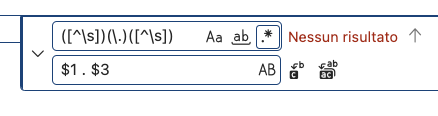

# 16/02/2026

[⏪ ieri](./2026-02-14_IT.md) | [index](../index.md) | [domani ⏩](./2026-02-17_IT.md)  
[Docs](/resources/docs/1.0/overview.md)

## Saltare un giorno

Di fatto è stato un reset, dove eravamo rimasti?  
Ok, sostituzione nelle pagine di user_contacts.id al posto di users.id e
di user_contacts.id [ricerca](./2026-02-13_user_id.code-search.md)

Le pagine che sto riformattando sono un potenziale cambio
con livewire 4, potendo mettere codice e blade in un solo file.
Però non è chiaro come le funzioni mount() rules() e le altre si possano
inserire nel codice quando gli unici esempi che propongono
sono relativi a modifiche di variabili "locali" come incrementi di contatore.

## branch db

In git le branch sono ramificazioni nella fase di sviluppo,
ma c'è una casistica in cui non basta la ramificazione sw
e serve una ramificazione db, ovvero quando introduco
nuove colonne nelle tabelle già presenti.
A quel punto il db che ho in locale non coincide con il db che ho in remoto
e devo prevedere anche una fase di upgrade per il db.

A parte questo, che potrebbe essere incapsulato un php che esegua
comandi sql, ma passare in locale da nuovo a vecchio o dal ramo
A al ramo B cambiando database, come faccio?

Ramo A può essere dev ramo B può essere Test, l'accesso
ai  dati deve "coprire" l file .env oppure dev'esserci
un file .env.codice-branch

## admin

Avere uno user admin può essere facile ma
c'è un solito però: Ho parecchie attività che
al momento "pescano" users.id da Auth::id(),
e può anche andare bene fino a quando non si deve
operare come admin. Quando un admin deve operare
al posto di un utente come fa?

Per il momento le funzioni admin saranno fatte
per admin e le funzioni user saranno fatte user.
Quindi 

## Generatore blocchi phpDoc

```sh
php artisan ide-helper:models
```

* Chiede di sovrascrivere i file in app/Models **yes**
* chiede di creare un _ide_helper **no**


## PSR-12, al punto

Una cosa che aveva fatto Pint era di incollare tutte le stringhe di log::info
togliendo spazi prima e dopo i punti operatore di unione stringa.  
E adesso viene segnalato come errore...  
Come rimettere uno spazio intorno ai punti operatore?


