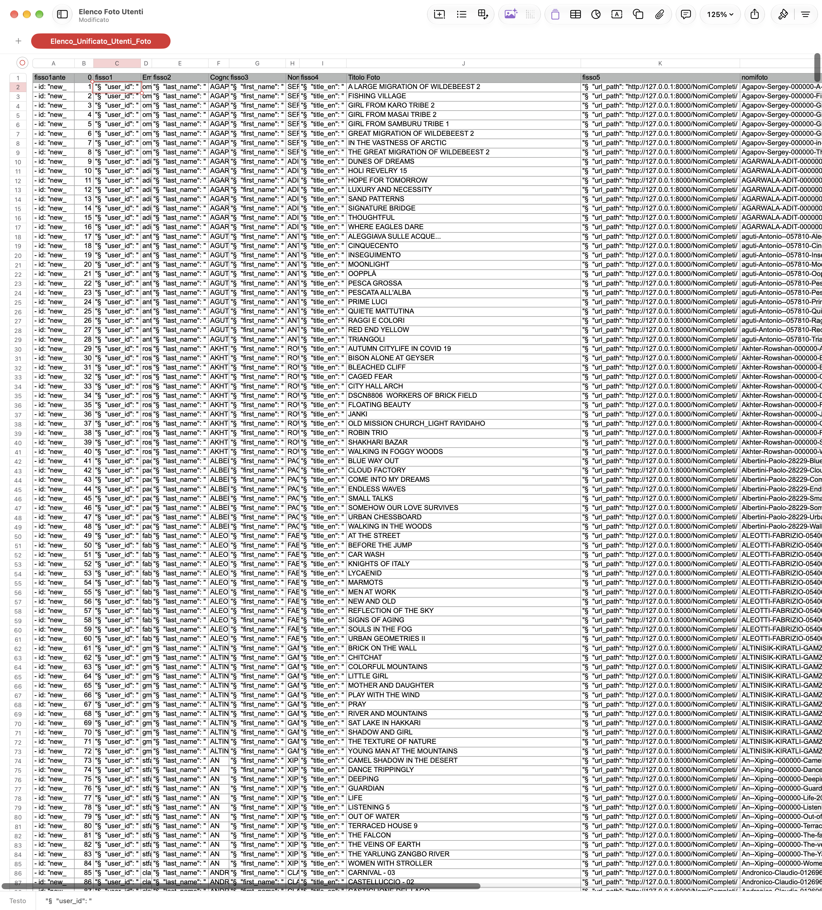
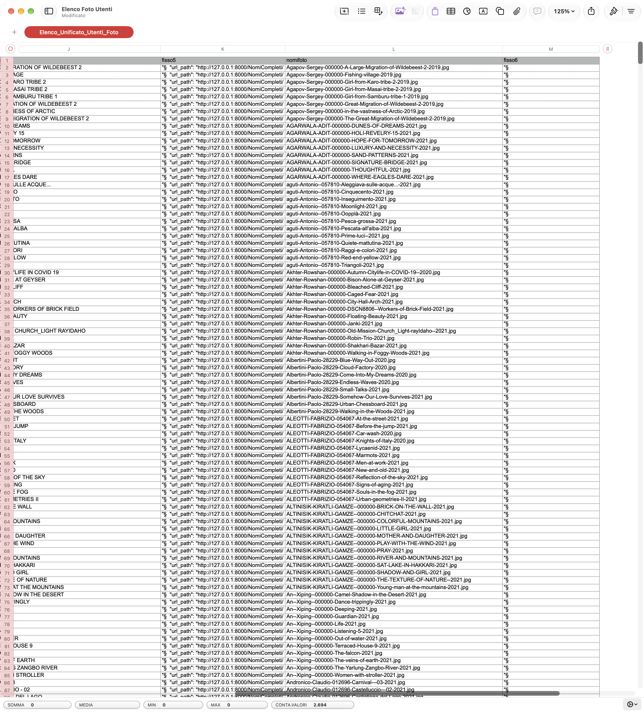

# 27/09/2026

| &nbsp;                                  | **Dev diary**                  | &nbsp;                                                |
| :---                                    | :---:                          | ---:                                                  |
| [Man](/resources/docs/1.0/index.md)     | [yaPCP](https://yapcp.test/)   | [Project](https://github.com/users/mrai64/projects/1/views/1?filterQuery=is%3Aopen&sortedBy%5Bdirection%5D=asc&sortedBy%5BcolumnId%5D=352635177&sortedBy%5Bdirection%5D=desc&sortedBy%5BcolumnId%5D=226158474) |
| [Man](https://yapcp.test/docs/)         | [Per dopo](./per_dopo.md)      | [Doc template](/resources/docs/dev/template.md)       |
| [<< ieri](./2026-09-26_IT.md)           | [index](../index.md)           | [domani >>](./2026-09-28_IT.md)                       |

## main sospesa

- composer audit
- composer update --dry-run
- aggiornamento diario

## refactor/0140-big-rebuild sospesa

## feat/0348-user-work-import

Ufff, sta cosa di caricare i dati del concorso mi è durata tra l'abbastanza
e la *rotturadipalle*, una cosa per me banale ma tediosa come allineare
qualche migliaio di elementi con duecentocinquanta nominativi
diventa un mangiatoken per Gemini, e pure per ChatGpt che si era
presentato un po' meglio spiegando chiaramente cosa stava facendo.
E che alla prima ce l'ha fatta ma alzando l'asticella di un elemento
è andato in out of token, ripassa più avanti. Dell'ia Agy non ne parliamo,
solo per visionare una carella e compilare un elenco di link ha consumato
decine di migliaia di token.

C'è anche che *mi rompe* fare uno script per un compito, ma per forza
di cose devo mettere in grado l'AIutante di fare meno scelte possibili
e più azione diretta.

Alla fine sti dati devo esporli? No, devo mettere la foto giusta
del concorrente giusto? No. *Esiqaatsi dice: allora fai cose più semplici*.
Prendi la manciata di email, prendi la manciata di foto, carica.

- elenco foto, abbinato ai nomi  
  ordinato
- elenco foto con titoli  
  ordinato uguale
- copia incolla
- inserimento delle colonne con i nomi e gli § a capo
- copia incolla da foglio a blocco note
- leva i tabulatori separatori
- cambia i caratteri § in acapo
- salva e rinomina come file yaml

File da concorso Elenco foto per giuria

- codice foto
- codice partecipante
- cognome partecipante
- nome partecipante
- sezione tema
- titolo opera in ordine alfabetico

Cestinare la cartella con le foto nominate e cercare
la cartella con le foto a sigla, perché è un solo elemento
al posto di N da incrociare. Asso nella manica: codice utente.
è unico ed è presente sia nella tabella foto che nella tabella
partecipanti.

Prompt:

Crea un solo elenco mettendo insieme i due fogli sulla base del "Codice Utente" campo numerico presente in entrambi, il rapporto è di 1:N tra il foglio "Elenco-Utenti *modificabile" e il foglio "Elenco-Foto-Giuria* modificabile".
Il foglio poi devo scaricarlo in formato testo TSV.

[share Gemini](https://share.gemini.google/yQ7HUG6hUtmR)

E ce l'ha fatta, veloce e senza fare storie, prima però ho
convertito foglio xls in excel 2007 xlsx, sia quello giuria che quello foto,
perché se mi ricordo giusto il formato interno di excel vecchio 97 xls
era binario e quello del 2007 è xml. Ma ho anche trovato in banca
delle table html salvate con estensione xls.

Adesso ho il foglione che mi serve veramente, e sto in discesa.
Tempo un'ora e ho raggiunto finalmente l risultato che volevo

- email, title_en, url_path.

Cambio tutti "email" in "user_id", perché quello fa chiave.  
Adesso cambio tutti i domini con archivio.athesis77.it tanto per...

```txt
grep find:      ((\"user_id\": \")(.*)@(.*))
replace with:   \2\3@archivio.athesis77.it"\n    "was_mail": "\3@\4
```

Se scarico un file al secondo 600 secondi ammesso vada tutto bene sono 600 file,
non pochi ma nemmeno quelli di un concorso che ne cuba migliaia.

per  provare serve caricare il server in download

Problema: doppi apici dentro doppi apici  
: "A"SUICIDE MODEL"" > "A 'SUICIDE Model'" oppure
: "A"SUICIDE MODEL"" > 'A "SUICIDE Model"' ✅
preferita la seconda perché se il titolo va confrontato
con altri elenchi cambiare il doppio apice all'interno di fatto
è cambiare il titolo.

## NO ERROR NO WORK

Si è verificato un falso messaggio positivo 'Ok, tutto bene'
a fronte di un nulla di fatto, e quindi nessun errore,
perché mancava in testa al file yaml il token `data:`,
quindi bug, va segnalato come errore l'importazione a vuoto.

Manca un id per user_work, che deve essere un uuid oppure
un id univoco nel caricamento.

Devo ripartire dal foglio excel e inserire una colonna di
id e un contatore.

Foglio generazione Yml 1 di 2


&nbsp;

Foglio generazione Yml 1 di 2


3000 record a un secondo ciascuno sono quasi 50 minuti,
se tutto va bene, di attesa. Se poi il caricamento
si interrompe all'immagine 1500, rilanciare daccapo
significa avere 1499 doppioni.
Per questo motivo anche in banca vengono fatti i commit
e il ricarico viene eseguito scartando tutti i record
fino a quello dell'ultimo commit fatto.
Se non si sa come fare un aggiornamento di tabella "siamo arrivati fin qui"
che resiste al rollback, la risposta è alla fine pure banale:
va fatto giusto prima del commit.

Errore di caricamento del file `Opplà`, che è stato cercato come `Ooppla%CC%80`
senza trovarlo.

Sì, essendo marcati new_qualcosa se si rilancia si caricano doppi,
sbagliato riproporli e giusto ricaricarli.
Servirebbe appunto l meccanismo di commit e la gestione
dello scarto degli input fino al record di commit
nella gestione dell'input.

Nella cartella del concorso sono presenti foto con lato lungo
oltre il 4000. Dovrebbe essere 2500. Però per lo sviluppo della
piattaforma questo non è negativo, anzi. Se ci sono delle immagini
che "sforano" il caricamento delle stesse dovrebbe essere
impedito in anticipo, e così ho materiale reale per il test.

Struttura di un "vero" importatore

- tabella dei checkpoint, 
  in questa tabella viene riportata
  una chiave di lettura che identifica il record
  in maniera univoca, in modo che quando
  si fa il checkpoint la si registra,
  abbinata a un identificativo della operazione,
  che deve essere sempre quello ad ogni lancio.
- file di input sequenziato,
  ovvero non un input casuale di dati ma un elenco
  che può essere scorso da inizio a fine
  perché si possa scorrere e ignorare fino a quando
  viene raggiunto il record identificato in
  tabella di commit.
- file di scarto, che deve contenere il record
  letto in input tale e quale, più un messaggio
  di errore che consenta a un operatore umano e non
  di modificare il record, se serve modificarlo,
  prima di riproporlo in input all'elaborazione.
  Per esempio può essere che il record non abbia nessun
  errore ma vada elaborato a una scadenza non ancora
  raggiunta e quindi resti parcheggiato nel giro dello scarto.
- serve anche un "parametro d input" che dica al job
  ogni quanto fare un checkpoint, ovviamente il minimo
  è ogni record, 1. Ma è ragionevole evitare di fare commit
  a ogni record se no ci sono particolari esigenze.
  
Trovato il doppio sfalssante:
Facheris Danilo - titolo Hard Friendship
Da qui in avanti il titolo e il file non corripspondono.

Serve ripartire dal file excel.

A rate, e un po' per volta ho trovato anche il vero file copia che
ho scartato, e concluso la importazione quasi corretta dei file
immagine di ciascun autore. Almeno una stima intorno al 95% degli autori
non ha copie doppie o opere sfalsare (titolo diverso dal file poi caricato).
Per il momento non mi interessa perché almeno questa importazione
**rivedibile** è conclusa e ho un parco concorrenti utle per fare dei test.

Sarebbe meglio non usare foto vere di concorsi veri, però.
Si fa sempre in tempo a resettare tutto, comprese le cartelle.
Ma dove trovare migliaia di foto stock gratuite?
