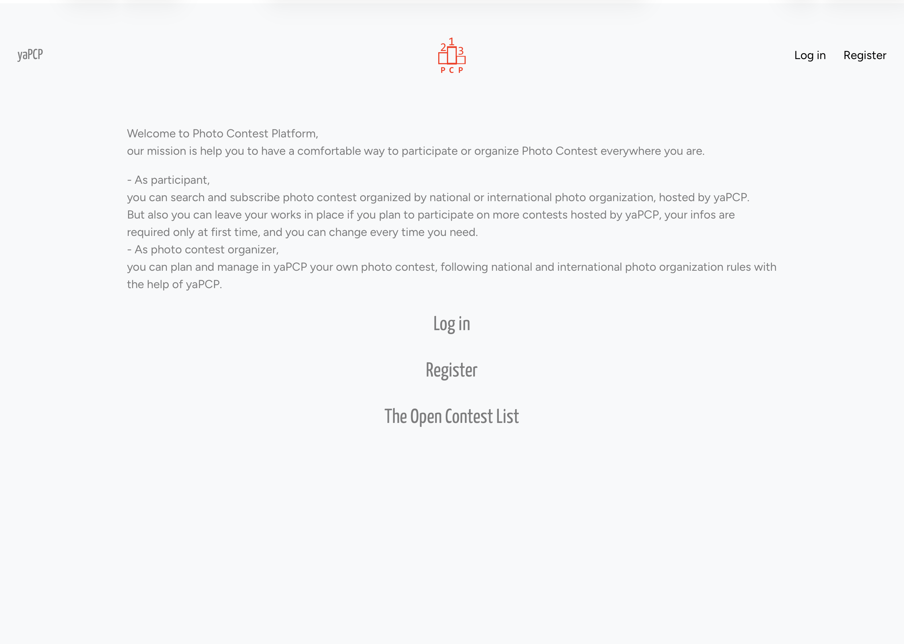
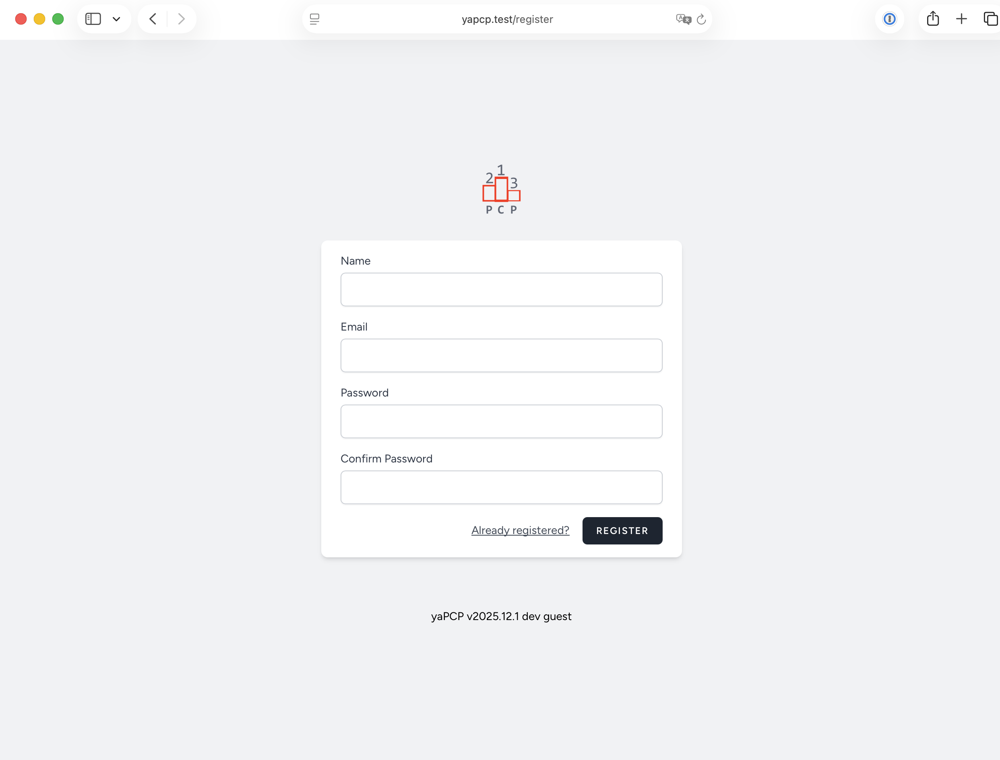
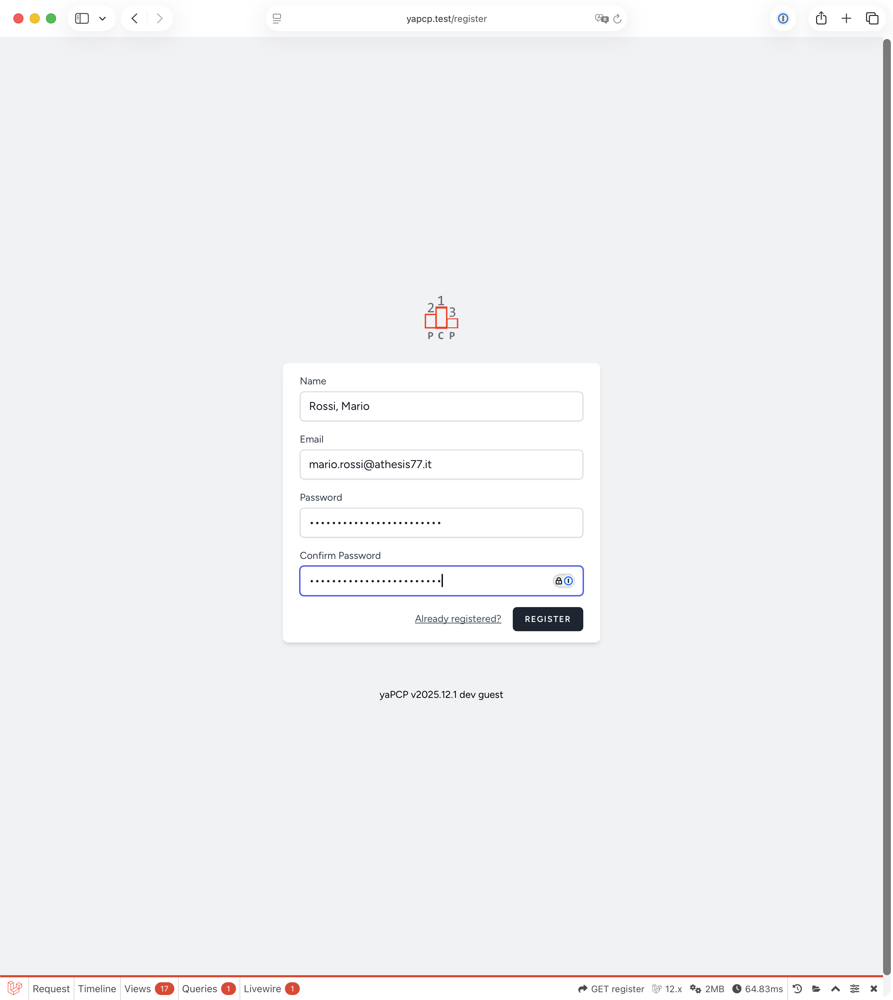
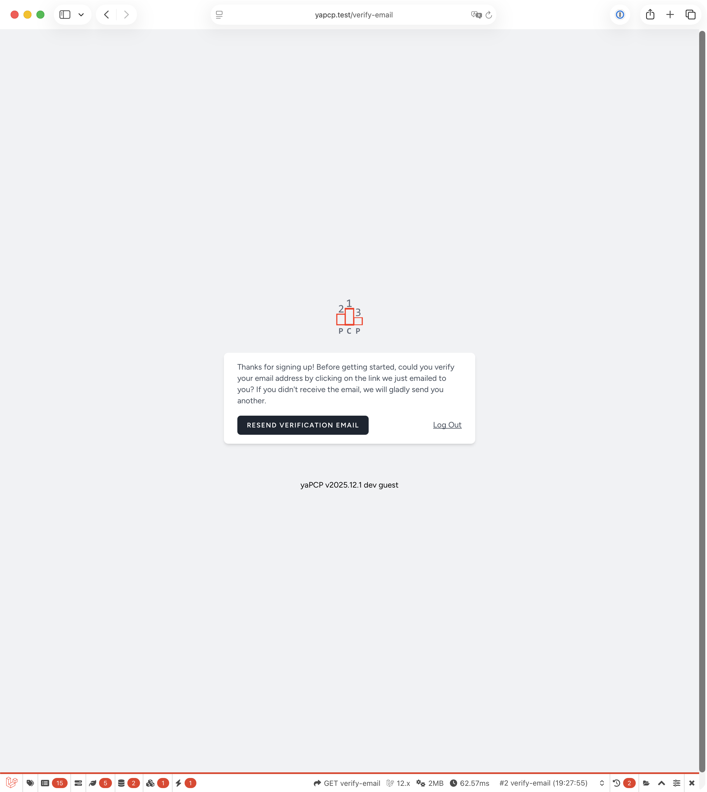

# User participants | Registration

---

## Registration to yaPCP

Some pages of yaPCP are free to public view,
but if you want participate on a contest that
is hosted in yaPCP the few operation needed
are the same of every photo contest in the
digital world.

*WARN:* images are reflecting development version
and may change from real use.

Start from address <http://yapcp.test> you see

### Registration

First we ask few infos, the minimum required to access
next. A name, an email address, and we suggest a
long, strong password. For password we say the
usual sysadmin recommendations: use some non-sense phrases
joining 5-6 short words and with '-', i.e.
dont-hack-my-yapcp-26-entry-pass-phrase 😁.
We can't recover your password anyway.

Check carefully all your data then an email will reach
your box to verify it's a real and monitored address.

